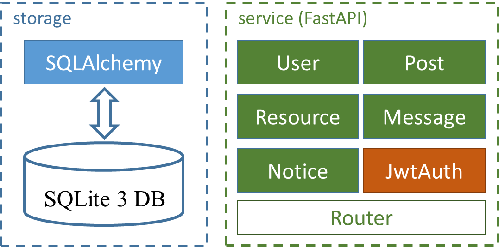

# THU BBS

Qi Ma; Xinran Yu; Yixiang Jia 

## Project Introduction

"THU BBS" is a campus forum APP for students, a platform for students to share news, make friends and chat.

## Key function design and implementation technology

### User Section

#### Input checks

When registering an account, setting a password, and modifying personal information, the user needs to enter a string in a specified format. For example, the email address and mobile phone number have a specified format, and the password has length and character restrictions. We use [Ratifier](https://github.com /Hamadakram/Ratifier) form verification library checks the specified format string (essentially based on regular expressions), and realizes that when entering characters, the prompt word disappears automatically, and the input password automatically turns to the "*" masking state. When the user input is invalid, a red exclamation mark icon will be displayed and the correct format will be prompted. If the mailbox has been registered or the password is incorrect, a dialog box will pop up to prompt the user.

#### Jump login page autofill

When the user completes the registration and jumps to the login page, we automatically fill in the email address and password for the user, and the user does not need to enter it again. At the same time, information such as user name, email address, token, avatar URL, etc. is stored through SharedPreferences.

#### Avatar circular display

Use Glide's apply(RequestOptions.circleCropTransform()) to load the image as the prototype, and [circleimageview](https://github.com/hdodenhof/CircleImageView)

#### Switch between Fragment/Activity

The switching between Fragments in the same Activity is done through `FragmentManager`, but there are still cases where Fragments are included in the Fragment, which is done with the help of `ViewPager` and `TabLayout`. In order to solve the problem of returning to the previous sub-Fragment after switching from the sub-Fragment of the Fragment Existing problems, you need to set ViewPager to

```java
viewPager.setSaveEnabled(false);
```

In order to enter a Fragment in another Activity from a certain Activity (for example, from `PostDetailActivity` to enter the Fragment of someone else’s homepage under `MainActivity`), it is necessary to specify which Fragment of the MainActivity to enter through the intent when StartActivity, and MainActivity needs In the onCreate function, determine whether the Fragment to be switched to is specified in the intent parameter.

```java
intent. putExtra("Fragment", "profileOtherUsers");
```

#### Unified information display module

View the post list on the home page, the post list by topic, the user's own post list, other user's post list, and the favorite post list. The tasks are the same, and they all need to display a post list. We unify them at the front end. For the same basic module, use the custom queryPost() function to obtain the specified post list from the backend according to different parameters (such as filtering parameters, sorting parameters, masking parameters, etc., see the backend section for details), thus realizing "one-time implementation, use many times".

### Information Release

#### position

The positioning uses the android positioning SDK provided by Tencent Location Services. We first obtain the longitude and latitude of the device through `locationManager` and `locationListener`, and then pass the obtained longitude and latitude of the device to `TencentLocationSdk` through the network to obtain the corresponding location name. (Note: Because the location of the android studio mobile emulator is in the United States by default, we first write the "acquired device latitude and longitude" as the location of the main building)

#### Select from the album or call the camera to take pictures or record videos

First, a selection dialog box is called up, allowing the user to choose whether to select a file from the photo album or call the camera to shoot. If you call the camera to take pictures or record videos, take video as an example, you must first create a video file name named after the current time, declare the intention of a camera’s recording behavior, and set the output path of the camera’s recording to the previously created video file. And assign the Uri of the video file to `capturedVideoUri`, and then you can upload the video you just recorded. If you are uploading an existing picture or video file, take the picture as an example, you need to get the path object of the selected photo, then call `uploadImage()` to upload to the backend, and the backend image bed will return a url, when publishing a post Unified upload as resource url.

### View information

#### Like animation

Use [LikeButton](https://github.com/jd-alexander/LikeButton) to achieve smooth animation effects of likes and collections

#### Image loading

Use [glide](https://github.com/bumptech/glide) to load images, display the comment area, the round avatar of the post author, and the image content of the post

#### Rich text display

Use [MarkdownView](https://github.com/tiagohm/MarkdownView) to render rich text, use github-style markdown themes, support basic markdown syntax such as bold, italic, six-level titles, tags, codes, mathematical formulas, emoji, etc.

#### Video Loading

Using Google's [ExoPlayer](https://github.com/google/ExoPlayer), solved the problem that `videoView` had too strict requirements on the video format and often failed to play, and used the progress bar and pause playback that comes with ExoPlayer button to provide users with more convenient video playback services.

### chat

You can enter the chat interface from the notification page or other people's homepage, which is essentially `RecyclerView`, which distinguishes whether the message is sent or received by the user through the sending/receiving ID of the message, so that it is displayed on the left and right sides respectively.

### notify

We have customized `NoticeModel`, which includes two types of user private message notifications and system notifications, which are distinguished by the boolean variable `isSystem`. System notifications include types such as likes, comments, and followers, and the detailed information is through nesting. `SystemNoticeDetail` class to define; private message notifications can be clicked to enter the chat interface.

### Telecommunication

We use the `retrofit2` networking library to initiate network requests and handle responses. The `GsonConverterFactory` of `retrofit2` is used to automatically parse the JSON character stream sent from the backend into the specified class, which simplifies the operation of manually parsing JSON and can safely handle exceptions. For example, for a registered Post request, you only need to specify the body class of the request and the class that receives the response in the API. `GsonConverterFactory` can automatically complete the serialization and deserialization operations from JSON to classes.

### animation

Start animation: by customizing `SplashActivity`, enter the homepage after playing the animation after a delay of 2 seconds

Content loading animation: use [Android-Loading-Animation](https://github.com/Marvel999/Android-Loading-Animation), but this library can only display the animation as a small part, and cannot block the entire page behind. To cover the content loading process of the following pages, we designed a "curtain" (loadingOverlay) that appears with the animation display and disappears after the animation is played

```java
// show loading animation
View loadingOverlay = view.findViewById(R.id.loadingOverlay);
loadingOverlay. setVisibility(View. VISIBLE);
// Execute the background loading task
queryPost(0);
handler. postDelayed(() -> {
     // turn off loading animation
     loadingOverlay. setVisibility(View. GONE);
     // display the following content
     recyclerView.setVisibility(View.VISIBLE);
     rootLayout.setVisibility(View.VISIBLE);
}, 2000); // 2 seconds delay to close the loading animation
```

Page switching animation: Zoom animation of [Bungee](https://github.com/Binary-Finery/Bungee) library, the principle is through

```
((Activity) context). overridePendingTransition()
```

### beautification

Components such as buttons use Google's [material components](https://github.com/material-components/material-components-android)

### other

Use **[butterknife](https://github.com/JakeWharton/butterknife)** to automatically bind views

### rear end

+ Handle authentication using *JSON Web Token* (JWT)

+ Compress video files to improve communication efficiency
+ Self-built picture bed, which can store pictures and videos stably
+ Automatically generate API online documentation via `FastAPI`

Service framework: `FastAPI`

Database: `SQLite3`

ORM framework: `SQLAlchemy`

Deployment scheme: nginx anti-proxy, `uvicorn` server



## Deployment instructions

For details, see the readme.md files in the `src/frontend` and `src/backend` directories

## user's guidance

See the operation guide document `Guide.pdf` for details

## Demo video

See [`THU BBS demo.mp4`](https://drive.google.com/file/d/12m2z4OGl5mo57YhSzqTdJiornMJkShh5/view?usp=sharing) for details
